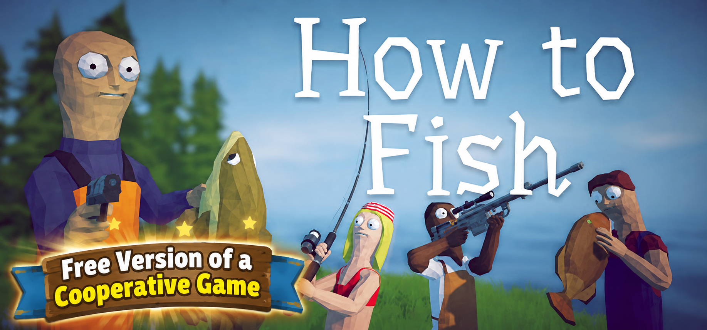
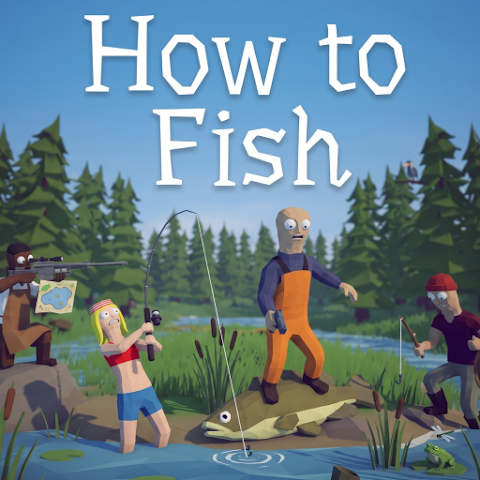
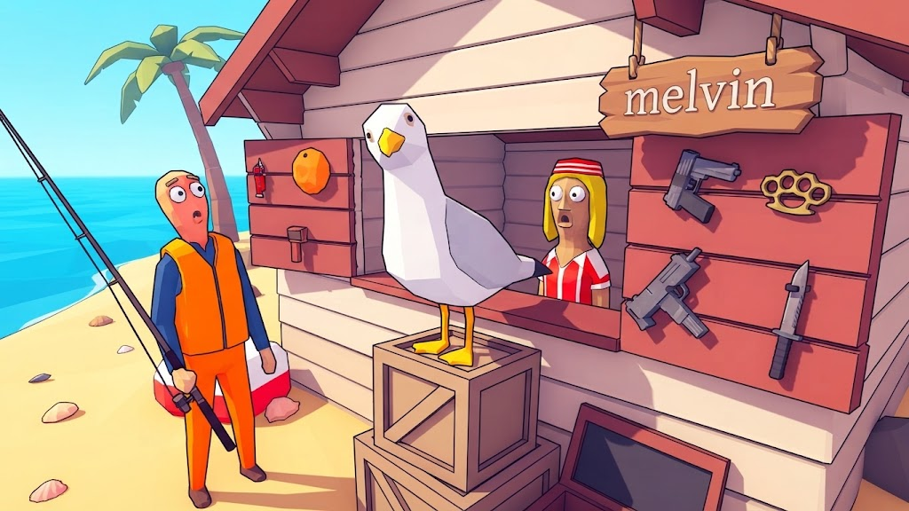

# How to Fish - Free Multiplayer

A physics-based fishing adventure for Windows with online co-op, exploration, quests, and boss fights.

  
  
  
  

  

## About the Game

You set out on a boat, but suddenly crash into a small island. To find your way home, you will have to learn how to fish.

At the beginning of the game, you have no weapons or equipment. Catch fish, sell your catch, earn money, and buy everything you need for the journey ahead. Complete quests and fight bosses to reach new islands, where more dangerous creatures and better equipment await.

Try to catch rare varieties of every fish, use different tricks to earn more money, and take a chance on gambling.

## Features

### Fishing and Economy

- Catch different types of fish.
- Search for rare fish varieties.
- Sell your catch to earn money.
- Buy equipment, weapons, and other useful items.

### Adventure and Progression

- Complete quests and fight bosses.
- Reach new islands as you progress.
- Face more dangerous creatures in new areas.
- Find improved equipment for the journey ahead.

### Online Co-op

Play together with other players in online co-op. The core game description is for 1-4 players. The provided update notes also mention lobbies of up to 8 players, private lobbies, and configurable session types.

## Screenshots

  
  

## System Requirements

|  | Minimum |
| --- | --- |
| **Operating system** | Windows 10 or later, 64-bit |
| **Processor** | Intel Core i5-5257U, AMD Ryzen 3 1200, or equivalent |
| **Memory** | 8 GB RAM |
| **Graphics** | GeForce GTX 1050, AMD RX 460, or equivalent |
| **Network** | Broadband Internet connection |
| **Storage** | 1 GB available space |

## How to Open the Game

1. Click **Download v1.2.1** at the top of this page and download the ZIP archive from the release's **Assets** section.
2. Open the ZIP archive and extract its contents to a separate folder.
3. If a password is requested, enter `1122532`.
4. Open the extracted folder and run the game executable.
5. Enjoy the game.

Keep all extracted game files together in the same folder.

## Update Notes

- **Update 1.0.4:** Added support for lobbies of up to 8 players and fixed a black-screen issue when joining a lobby.
- **Update 1.0.5:** Added private lobbies and the ability to change the session type.
- **Patch 1.0.6:** Improved save validation and fixed the appearance of invalid server names caused by invalid saves.
- **Update 1.0.9:** Added Steam connection diagnostics to the main menu. A red Steam Relay status indicator means that the connection has failed.

## Project Information

| Property | Details |
| --- | --- |
| **Project** | How to Fish - Free Multiplayer |
| **Version** | v1.2.1 |
| **Platform** | Windows |
| **Genre** | Fishing, adventure, multiplayer |
| **Players** | 1-4 |
| **Online co-op** | Supported |
| **Distribution** | With permission from the developers |

## Distribution

The game and the materials included in this repository are distributed with permission from the developers.

## Disclaimer

This repository is an independent distribution page for How to Fish - Free Multiplayer. The game and its included materials are provided under the distribution permission granted by the developers.
                                                                                                    